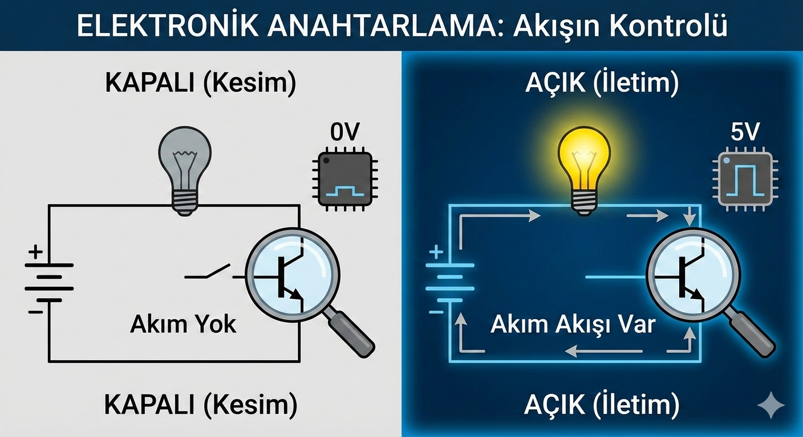
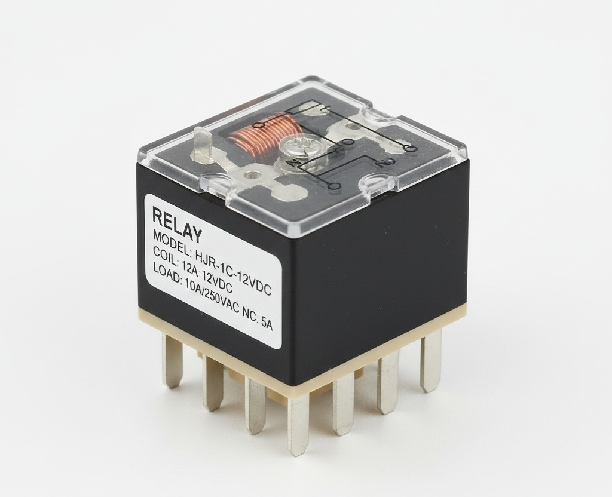
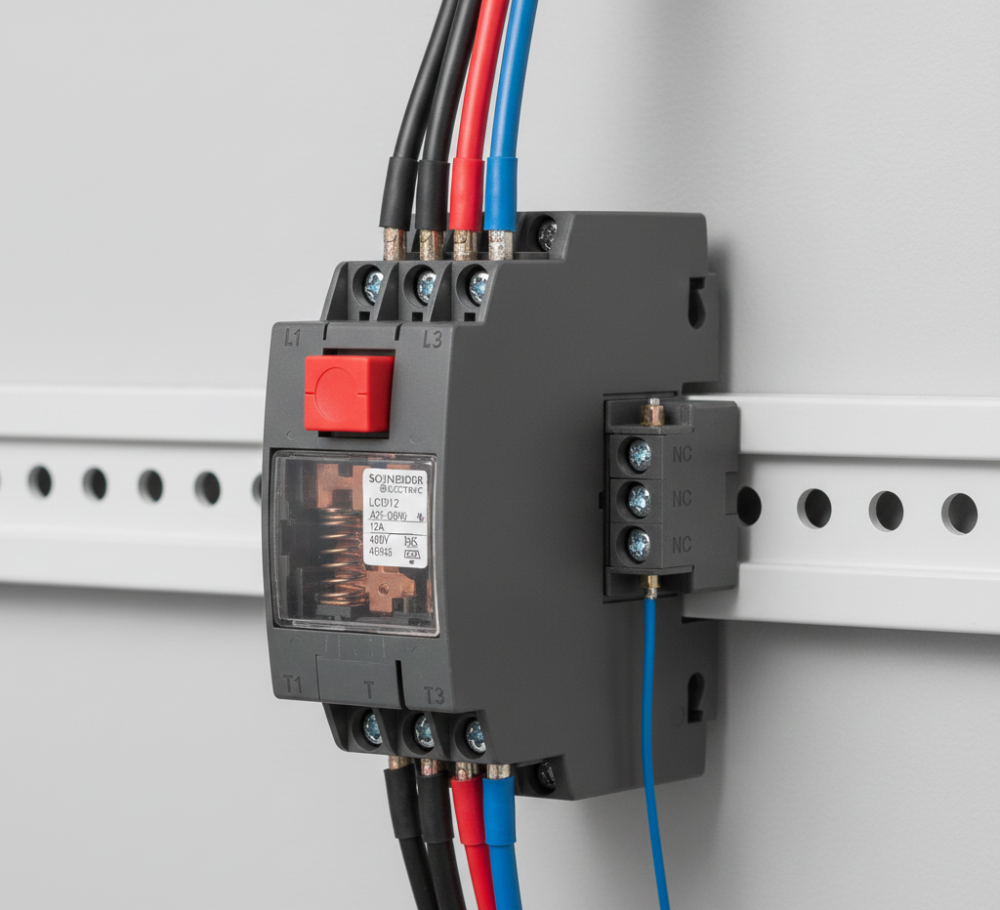
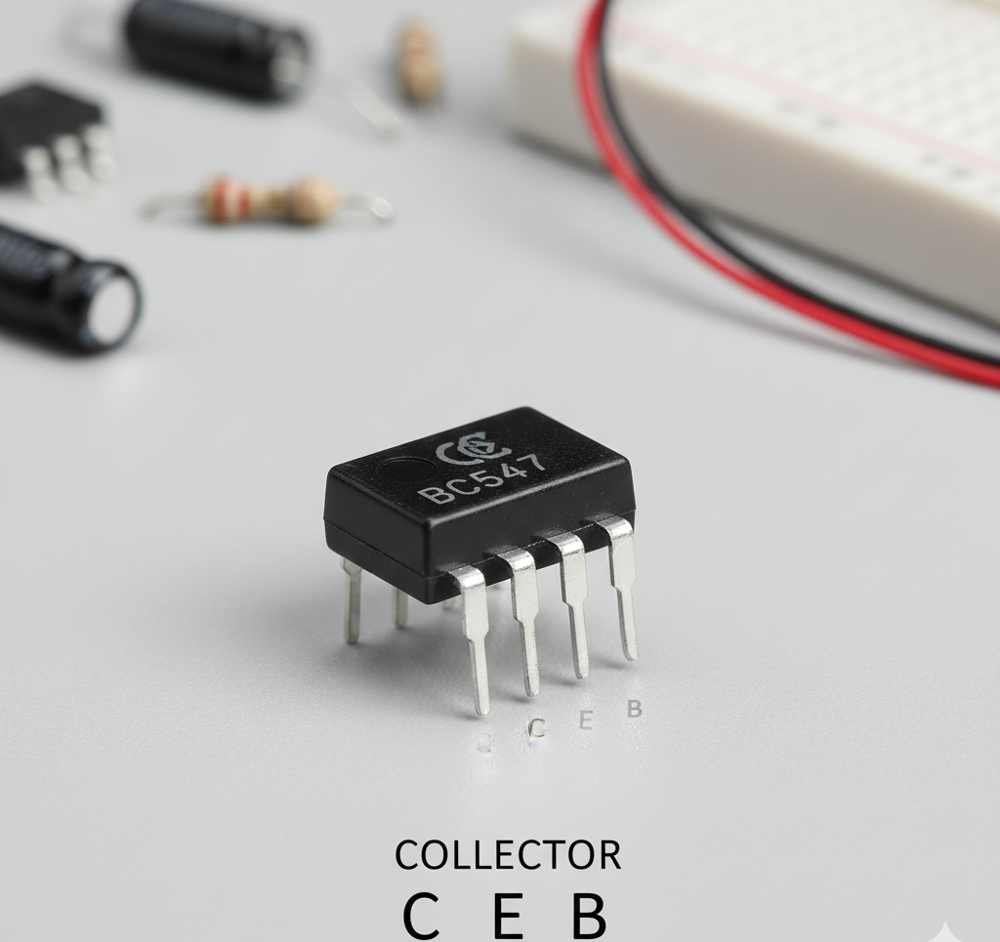
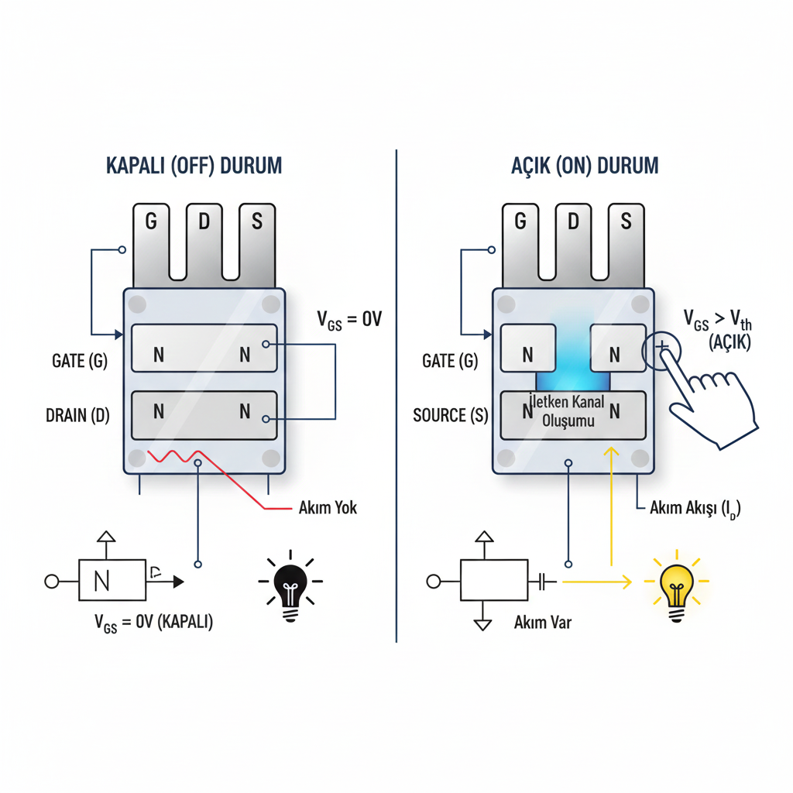
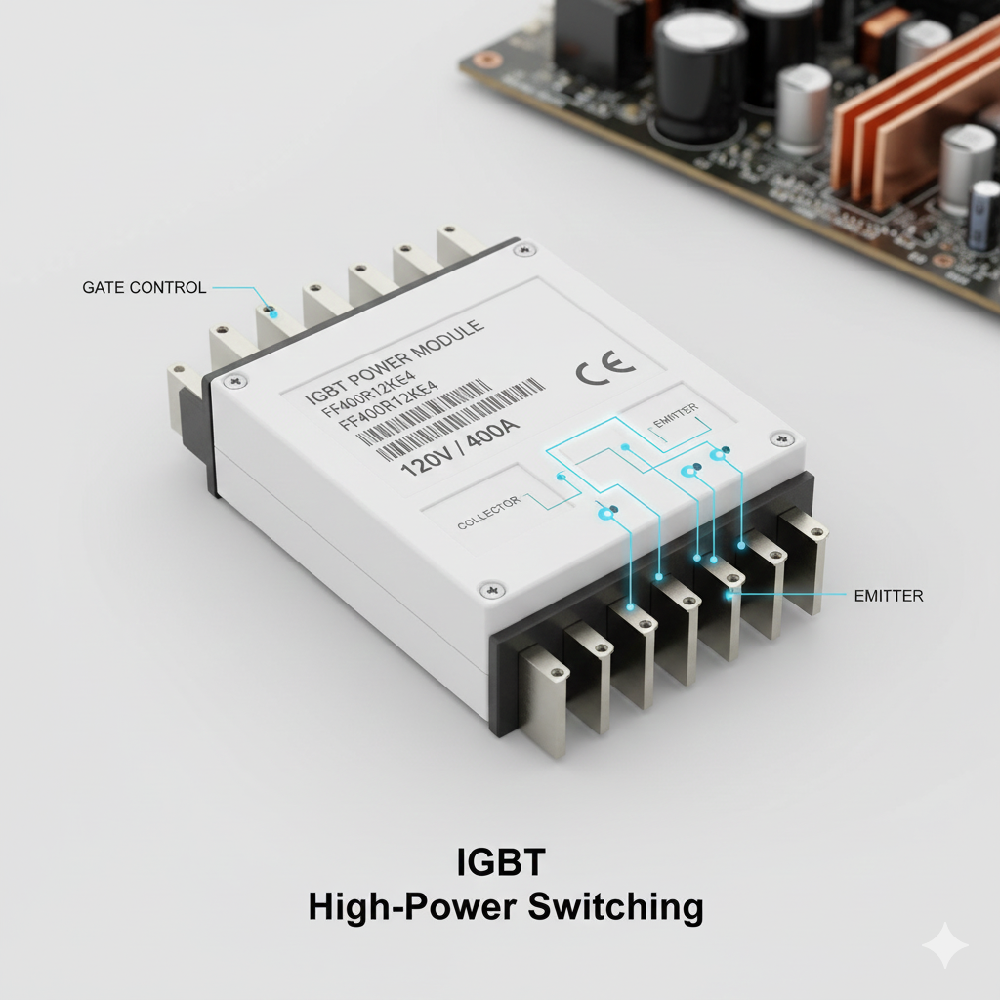
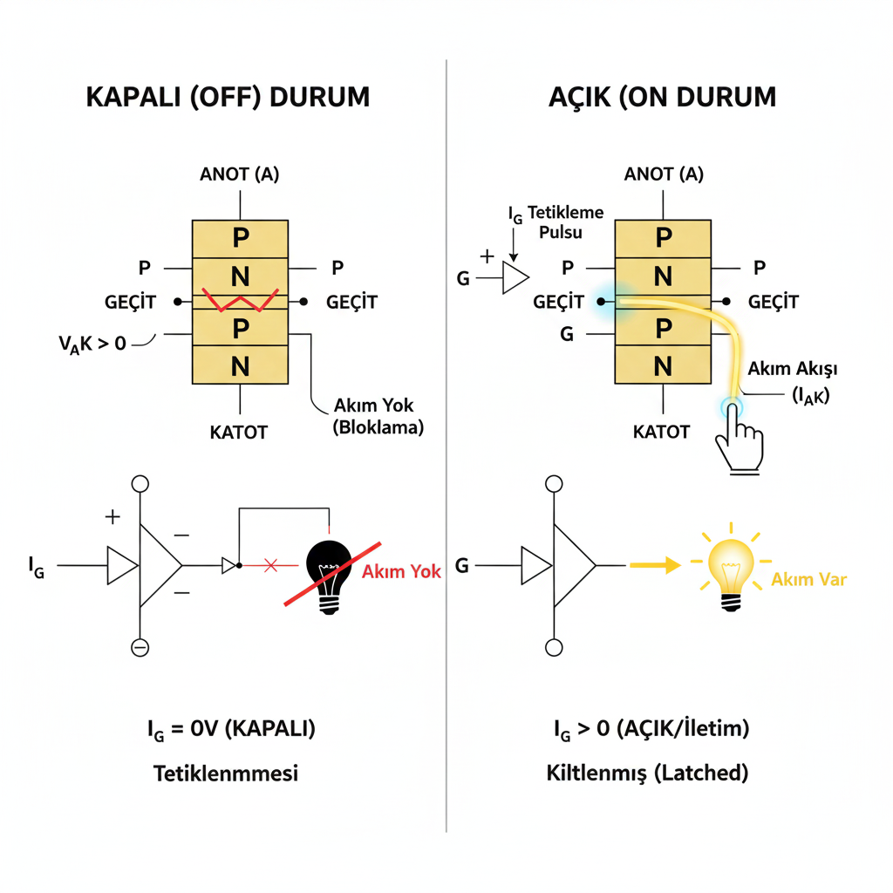
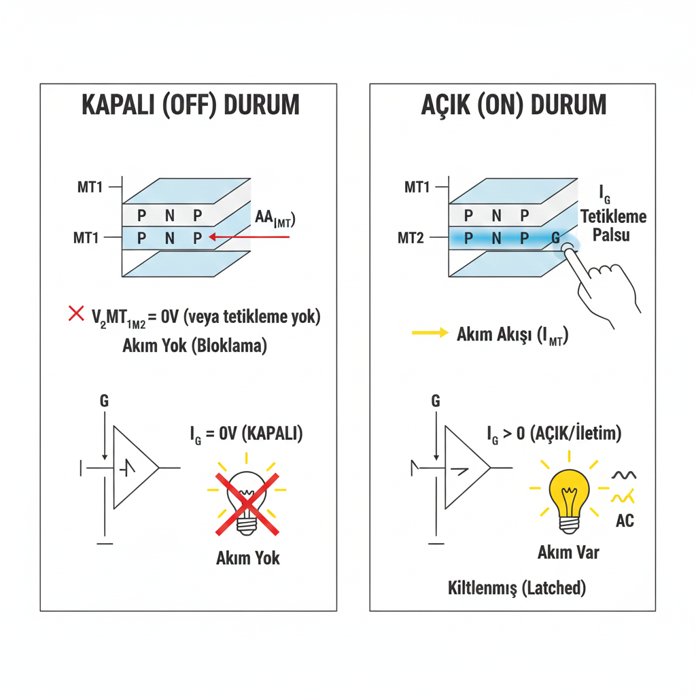
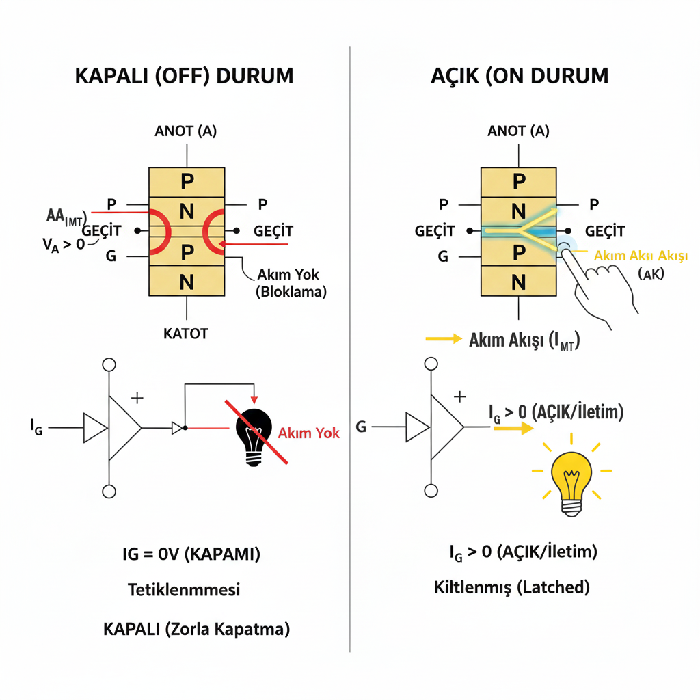

---
page->layout = "post";
page->title  = "ANAHTARLAMA ELEMANLARI";
page->description = "Anahtarlama Elemanları Nasıl Çalışır";
page->date ="15/12/2025";
SET_POST();
---

**Anahtarlama:** Elektronik anahtarlama, elektrik ve elektronik sistemlerde enerji akışını kontrol etmek, yani devreleri açıp kapatmak veya farklı yollara yönlendirmek için kullanılan temel bir işlemdir. Günlük hayattaki ışık anahtarının daha hızlı, küçük ve genellikle yarı iletken elemanlarla (transistör, MOSFET, IGBT vb.) gerçekleştirilmesidir.
<figure>

<figcaption><strong>Şekil 1.1</strong> Anahtarlama Elemanının "on" ve "off" Durumu </figcaption>
</figure>
Yukarıdaki görselde anahtarlama elemanının "on" ve "off" durumdaki davranışı verilmiştir.

- **AÇIK Konum (İletim - ON):** Anahtarlama elemanı (örneğin transistör) tam iletimdedir. Üzerinden akım kolayca geçer ve devrenin yüküne (bir lamba, motor vb.) enerji verilir. Bu durumda eleman üzerindeki gerilim düşümü (voltaj) çok düşüktür.

- **KAPALI Konum (Kesim - OFF):** Anahtarlama elemanı akımı tamamen keser. Üzerinden neredeyse hiç akım geçmez ve yüke enerji gitmez. Bu durumda eleman üzerinde gerilim düşümü yüksektir.

**Anahtarlamaya Neden İhtiyaç Vardır:**
Elektronik anahtarlamaya, modern elektronik sistemlerin neredeyse tamamının dayandığı temel işlevleri yerine getirmek ve geleneksel yöntemlere göre üstün verimlilik, kontrol ve boyut avantajları sağlamak için ihtiyaç duyulur.

- **Enerji Verimliliği ve Isı Yönetimi:** Elektronik anahtarlamanın en kritik avantajı ve en büyük gereklilik nedeni yüksek verimlilik sağlamasıdır.

- **Verimlilik:** Geleneksel güç kaynakları (doğrusal regülatörler), istenmeyen fazla enerjiyi sürekli olarak ısıya dönüştürerek (kayıp olarak) voltajı düzenler. Oysa anahtarlama elemanları (Transistörler, MOSFET'ler) ya tamamen AÇIK (akım düşük dirençle akar) ya da tamamen KAPALI (akım akmaz) konumda çalışır.

- **Düşük Güç Kaybı:** Bir eleman ya hiç akım geçirmez ya da üzerinde neredeyse hiç gerilim düşümü oluşturmaz. Güç kaybı P = V x I  formülüyle hesaplandığında, hem V'nin hem de I'nın aynı anda yüksek olmadığı bu iki durumda kayıp minimuma iner. Bu sayede verimlilik genellikle %80-%95 seviyelerine ulaşır.

- **Isı Azaltma:** Düşük kayıp demek, daha az ısı üretimi demektir. Bu da büyük soğutucu (ısı alıcı) kullanma ihtiyacını azaltır, sistemin güvenilirliğini ve ömrünü artırır.

**Boyut ve Ağırlık Avantajı:**  
Anahtarlamalı Güç Kaynakları'nın (SMPS - Switch Mode Power Supply) en belirgin özelliği, küçük ve hafif olmalarıdır.

- **Yüksek Frekans:** Anahtarlama, çok yüksek frekanslarda (kHz seviyelerinde) yapılır. Güç dönüşüm devrelerinde kullanılan transformatörlerin ve indüktörlerin boyutu, çalışma frekansı ile ters orantılıdır.

- **Kompakt Tasarım:** Frekansı yükselterek bu bileşenlerin fiziksel boyutları geleneksel transformatörlere göre büyük ölçüde küçültülür. Bu, dizüstü bilgisayarların şarj cihazları, cep telefonları ve diğer tüm kompakt elektronik cihazlar için hayati bir gerekliliktir.  

**Kontrol ve Esneklik:**
Anahtarlama, enerji akışını hassas ve dinamik bir şekilde kontrol etme yeteneği sunar. 

- **Voltaj Dönüşümü:** Anahtarlama teknikleri (özellikle Darbe Genişlik Modülasyonu - PWM kullanılarak), giriş geriliminden daha yüksek (yükseltici/boost) veya daha düşük (düşürücü/buck) çıkış gerilimleri elde etmeye olanak tanır. Geleneksel doğrusal regülatörler bunu yapamaz.

- **Motor Kontrolü:** Elektrikli motorların hızını, torkunu ve yönünü hassas bir şekilde kontrol etmek için invertörlerde ve sürücülerde anahtarlamaya ihtiyaç duyulur.

- **Dijital İşleme:** Bilgisayar işlemcileri, sinyalleri milyarlarca kez açıp kapatan (anahtarlayan) milyarlarca transistörden oluşur. Bu, tüm dijital hesaplama ve veri işleme süreçlerinin temelidir.

**Anahtarlama Elemanları:**
Bir devrede akımın açılıp kapanmasını, yönlendirilmesini veya kontrol edilmesini sağlayan elemanlardır.

 **1-Elektromekanik Anahtarlar:** Bu elemanlar yarı iletken değildir, ancak elektrik kontrolünü fiziksel hareketle sağlarlar.

- **1.1-Röle (Relay):** Küçük bir elektrik akımı (kontrol devresi), elektromıknatıs yaratarak büyük bir akımı taşıyan mekanik kontakları hareket ettirir ve ana devreyi açıp kapatır. Kontrol ve ana devre arasında tam elektriksel izolasyon sağlar.

<figure>

<figcaption><strong>Şekil 1.2</strong> Röle </figcaption>
</figure>

- **1.2-Kontaktör:** Rölenin endüstriyel ve çok yüksek akım taşıma kapasitesine sahip versiyonudur. Motorları ve büyük yükleri çalıştırmak için kullanılır.

<figure>

<figcaption><strong>Şekil 1.3</strong> Kontaktör </figcaption>
</figure>

**2-Transistör Tabanlı Anahtarlar:** Bu elemanlar, modern dijital elektronik ve yüksek frekanslı güç kontrolünün temelini oluşturur. Hepsi bir kontrol sinyali (Baz/Kapı) ile hem açılıp hem de kapatılabilir.

- **2.1 BJT:** BJT (Bipolar Junction Transistor), elektroniğin temel yarı iletken elemanlarından biridir. Akım kontrollü bir transistördür ve yükseltme (amplifikatör) ile anahtarlama amaçlı kullanılır.

*BJT, üç uçtan oluşur:*

- Emitter (E) – Akımı veren uç
- Base (B) – Kontrol ucu
- Collector (C) – Akımı toplayan uç

Base’e çok küçük bir akım vererek, Collector–Emitter arasındaki daha büyük bir akımı kontrol ederiz.

<figure>

<figcaption><strong>Şekil 1.4</strong> BJT </figcaption>
</figure>

- **2.2 MOSFET:** MOSFET (Metal-Oxide-Semiconductor Field-Effect Transistor), gerilim kontrollü bir yarı iletken elemandır. MOSFET'ler, geleneksel transistörlerin (BJT'ler) aksine Gerilim Kontrollü elemanlardır. Bu, akımı kontrol etmek için girişe akım yerine sadece gerilim uygulanması gerektiği anlamına gelir. Bu özelliği sayesinde çok hızlı anahtarlama yapabilir ve kontrol devresinde neredeyse hiç akım çekmezler.

*MOSFET, üç uçtan oluşur:*

- Gate (G) – Kontrol ucu
- Drain (D) – Akımın girdiği uç
- Source (S) – Akımın çıktığı uç

MOSFET'in çalışmasının anahtarı, Gate terminaline uygulanan gerilimin yarattığı Elektrik Alanı ile Source ve Drain arasındaki iletkenlik kanalını kontrol etmesidir.

<figure>

<figcaption><strong>Şekil 1.5</strong> MOSFET </figcaption>
</figure>

- **2.3 IGBT:** IGBT (Insulated Gate Bipolar Transistor), MOSFET’in kolay sürülmesi ile BJT’nin yüksek akım taşıma yeteneğini birleştiren bir güç yarı iletkenidir. Özellikle yüksek gerilim ve yüksek akım uygulamalarında kullanılır.

*IGBT’nin 3 ucu vardır:*

- Gate (G) – Kontrol ucu (yalıtılmıştır)
- Collector (C) – Güç girişi
- Emitter (E) – Güç çıkışı

Gate’e uygulanan gerilim, Collector–Emitter arasındaki büyük akımı açıp kapatır.

<figure>

<figcaption><strong>Şekil 1.6</strong> IGBT </figcaption>
</figure>

**3-Tristör Tabanlı Anahtarlar:** Bu elemanlar, özellikle yüksek gerilim ve yüksek akım gerektiren endüstriyel güç kontrol uygulamalarında kullanılır. Genellikle yalnızca bir kontrol sinyali ile AÇILIRLAR, kapatılmaları (Kesim) devrenin kendiliğinden akımı sıfırlamasına (AC devre) veya harici bir devreye bağlıdır.

- **3.1-SCR:** (Silikon Kontrollü Doğrultucu / Tristör) DC ve AC uygulamalarında kullanılır. Bir kez tetiklendiğinde, akım sıfıra düşene kadar iletimde kalır. Yüksek güç ve gerilim uygulamalarında kullanılan, tetiklemeli bir yarı iletken anahtardır. Diyot gibi tek yönde iletir ama kontrollüdür.

*SCR’nin 3 ucu vardır:*

- Anot (A)
- Katot (K)
- Gate (G)

SCR’nin çalışması temelde kontrollü bir anahtar mantığına dayanır. Anot ve katot arasına doğru yönde bir gerilim uygulandığında, yani anot katoda göre pozitif olduğunda SCR normalde kapalı durumdadır ve iletime geçmez. Bu durumda diyottan farkı, kendi kendine iletmemesi, mutlaka kontrol edilmesi gerekmesidir.

SCR’nin iletime geçmesi için gate ucuna kısa süreli bir akım uygulanır. Gate’e verilen bu küçük akım, elemanın iç yapısındaki PNPN katmanlarını tetikler ve anot–katot arasında büyük bir akımın akmasına izin verir. Bu tetikleme anından sonra SCR açık duruma geçer ve anot ile katot arasında neredeyse kısa devre gibi davranır. Buradaki önemli nokta, gate akımının sürekli olmasının gerekmediğidir; tetikleme gerçekleştikten sonra gate artık devre dışı kalır.

SCR açıldıktan sonra “kilitlenme” denilen bir durum oluşur. İç yapıda akan akım, elemanın iletimde kalmasını kendi kendine sürdürür. Bu yüzden gate sinyali kesilse bile SCR kapanmaz. SCR’nin açık kalabilmesi için anot üzerinden akan akımın belirli bir seviyenin, yani tutma akımının üzerinde olması gerekir.

SCR’nin kapanması gate ile mümkün değildir. Kapanabilmesi için anot akımının sıfıra düşmesi gerekir. Alternatif akım (AC) devrelerinde bu durum doğal olarak gerçekleşir; çünkü sinüs dalgası her periyotta sıfırdan geçer ve bu anda SCR otomatik olarak kapanır. Doğru akım (DC) devrelerinde ise akım kendiliğinden sıfıra düşmez, bu yüzden SCR’yi kapatmak için akımı kesen ek devreler, yani komütasyon yöntemleri kullanılır.

<figure>

<figcaption><strong>Şekil 1.7</strong> SCR </figcaption>
</figure>

- **3.2-TRIAC:** Alternatif akımın (AC) her iki yarım dalgasında da akımı kontrol edebilir. Dimmer (ışık ayarlayıcı) devrelerinde ve küçük motor kontrolünde yaygındır.Temel olarak SCR’e benzer ama farkı, her iki yönde de akımı iletebilmesidir, yani hem pozitif hem de negatif yarı döngülerde çalışabilir. Bu özelliği sayesinde AC güç kontrolünde çok yaygın kullanılır, örneğin lamba dimmerleri, ısıtıcılar veya motor hız kontrol devrelerinde.

*TRİAC’In 3 ucu vardır:*

- Anot1 (MT1)
- Anot2 (MT2) 
- Gate (G)

ate ucu, cihazı tetiklemek için kullanılır. Normalde MT1 ve MT2 arasındaki akım, gate tetik sinyali olmadan akmaz. Gate’e kısa süreli bir tetikleme akımı uygulandığında, TRIAC iletime geçer ve MT1 ile MT2 arasından akım geçmeye başlar. Farklı olarak, SCR’in aksine TRIAC hem AC’nin pozitif hem de negatif yarı döngülerinde açılabilir; yani tetikleme hangi yönde olursa olsun akımı geçirir.

TRIAC bir kez iletime geçtiğinde, gate etkisi artık gerekli değildir. Cihaz, üzerinden geçen akım belirli bir eşik seviyenin altına düşene kadar iletimde kalır. AC devrelerinde, her yarım periyotta akım sıfır noktasına ulaştığında TRIAC kendiliğinden kapanır ve bir sonraki tetiklemeye kadar kapalı kalır. Bu nedenle AC kontrol uygulamalarında doğal olarak anahtarlama yapar.

<figure>

<figcaption><strong>Şekil 1.8</strong> TRİAC </figcaption>
</figure>

- **3.3-GTO:** SCR'ye benzer ancak ek bir ters sinyal ile zorla kapatılabilme (Turn-Off) özelliğine sahiptir (Artık yerini büyük ölçüde IGBT'lere bırakmıştır). Gate ile hem açılabilen hem de kapatılabilen bir tristördür. Yani SCR’de olduğu gibi yalnızca gate ile tetiklenip kendi kendine kapanan yapının aksine, GTO’da gate ile iletim açılıp kapatılabilir, bu da onu özellikle DC motor sürücüleri, güç elektroniği ve inverter uygulamalarında değerli kılar.

*GTO’nUn 3 ucu vardır:*

- Anot (A)
- Katot (K) 
- Gate (G)

Çalışma prensibi SCR’ye çok benzerdir. Normalde anot katoda göre pozitif olduğunda ve gate’e tetik verilmediğinde GTO kapalıdır. Gate’e kısa süreli bir akım uygulandığında, GTO iletime geçer ve anot-katot arası büyük bir akım akmaya başlar. Bu aşamada gate artık tetikleme ucu olarak devreye alınmamış olsa bile cihaz iletimde kalır.

GTO’nun en önemli farkı, iletim halindeyken gate üzerinden ters yönlü bir akım uygulanarak cihazın kapatılabilmesidir. Gate’e negatif bir darbe verildiğinde, iletim kanalı kapanır ve anot-katot akımı sıfıra düşer. Bu özelliği sayesinde DC devrelerde SCR’in aksine ekstra komütasyon devrelerine gerek kalmadan cihaz kontrol edilebilir.

<figure>

<figcaption><strong>Şekil 1.9</strong> GTO </figcaption>
</figure>