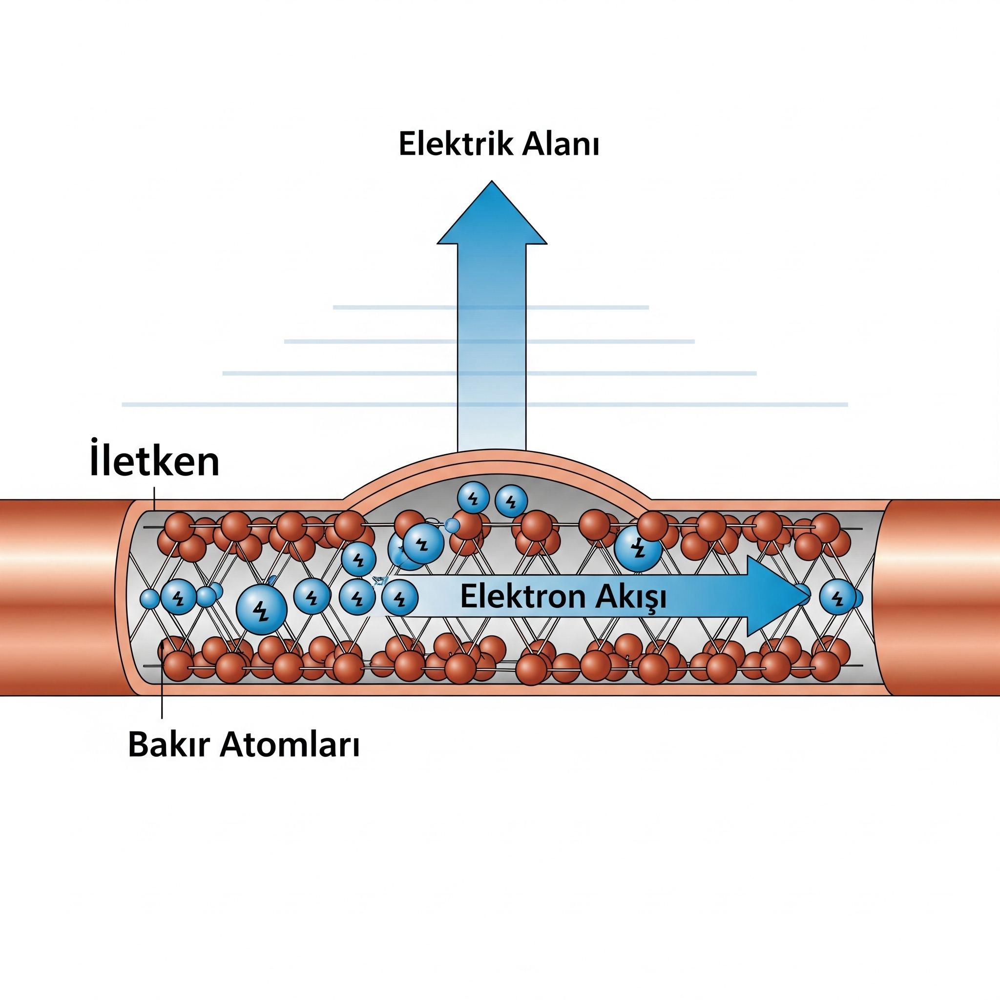

---
page->layout = "post";
page->title  = "AKIM";
page->description = "Akım ve Elektronlar Arasında Nasıl Bir Bağ Var";
page->date ="20/08/2025";
SET_POST();
---

**Akım:** Elektrik akımı, bir iletkenin kesitinden birim zamanda geçen net elektrik yükü miktarıdır. Birimi Amper'dir (A). Bir amper, bir saniyede geçen bir Coulomb'luk yüke eşittir.
<figure>

<figcaption><strong>Şekil 1.1</strong> Bakır Kabloda İletilen Akım </figcaption>
</figure>
Yukarıdaki görselde elektrik iletimi için kullanılan bakır kabloya ait bir görsel verilmiştir.  
- İletken: Görselin merkezinde yer alan, kesit görünümüyle gösterilmiş olan bakır kablo, "İletken" olarak adlandırılır. Elektrik akımının içinden geçtiği maddeyi temsil eder.

- Bakır Atomları: İletkenin içinde, dairesel ve kahverengi toplar şeklinde gösterilen yapılar "Bakır Atomları"dır. Bu atomlar, iletkenin sabit yapısını (kristal kafesi) oluşturur.

- Elektron Akışı: Mavi renkli, küçük ve üzerinde eksi (-) işareti bulunan küreler elektronları temsil eder. Bu elektronlar, iletkenin içindeki atomlar arasında belirli bir yönde hareket eder. Bu yönlü ve düzenli harekete "Elektron Akışı" denir ve elektrik akımını oluşturan temel şeydir. Görseldeki oklar da bu akışın yönünü göstermektedir.

- Elektrik Alanı: İletkenin üstünde yer alan büyük mavi ok, "Elektrik Alanı"nı temsil eder. Bu alan, elektronların belirli bir yönde hareket etmesini sağlayan itici gücü oluşturur. Bu, bir pilin veya güç kaynağının devreye uyguladığı kuvvettir.

**Elektronlar ve Akım Arasındaki İlişki:**
Temel olarak, elektrik akımının taşıyıcıları elektronlardır. Metal gibi iletken maddelerde, bazı elektronlar atomlarına sıkıca bağlı değildir ve serbestçe hareket edebilirler. Bu serbest elektronlar, bir dış elektrik alan uygulandığında (örneğin bir pile bağlandığında) belirli bir yönde hareket etmeye başlar. Bu düzenli ve yönlü elektron akışı, elektrik akımını oluşturur.  

**Elektronlar Çok Yavaştır, Ama Elektrik Çok Hızlı!**  

 Bir kablodaki her bir elektronun hareketi, "sürüklenme hızı" olarak adlandırılır ve bu hız aslında çok yavaştır, saniyede sadece birkaç milimetre. Ancak, anahtara bastığınız anda ampulün anında yanmasının sebebi, elektrik sinyalinin hızının ışık hızına yakın olmasıdır. Elektrik akımı, elektronların kendisi değil, elektronların bir domino etkisiyle birbirlerini iterek oluşturduğu enerjinin iletimidir. Bu enerji, kablo boyunca neredeyse ışık hızında (saniyede yaklaşık 200.000 km) yayılırken, elektronlar yerlerinde çok yavaş hareket ederler.  

**Özetle:**

Elektrik akımı, elektronların düzenli ve yönlü hareketidir.  

Akımın yönü, tarihsel nedenlerden dolayı pozitif yüklerin hareket yönü olarak kabul edilirken, elektronlar aslında ters yönde hareket eder. Bu durum, pratikte bir sorun teşkil etmez.  

Bir devreye enerji verildiğinde (örneğin pil takıldığında), pilin bir ucu pozitif, diğer ucu negatif hale gelir. Negatif uç, elektronları iterken, pozitif uç onları çeker. Bu itme ve çekme kuvveti, elektronların kablo boyunca hareket etmesini sağlar.  

Ne kadar çok elektron bir kesitten birim zamanda geçerse, akım şiddeti de o kadar büyük olur.  

Bu ilişkiyi bir benzetmeyle daha iyi anlayabiliriz: Bir su borusunda akan su gibi düşünebilirsiniz. Borudaki su molekülleri elektronları temsil ederken, suyun akışı ise elektrik akımını temsil eder. Ne kadar çok su birim zamanda borudan geçerse, suyun debisi de o kadar yüksek olur.  
