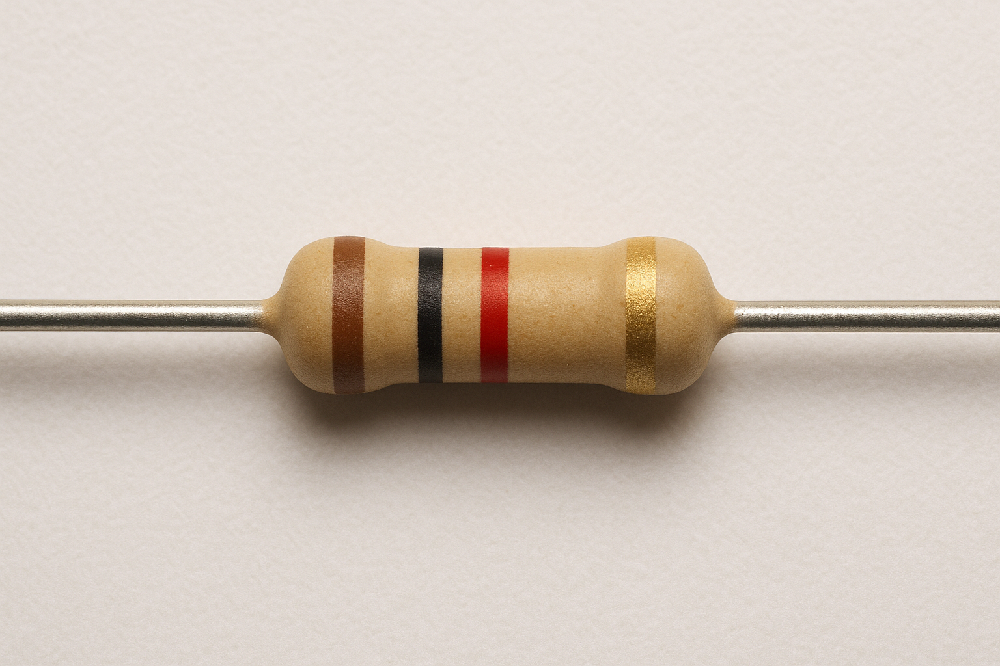

---
page->layout = "post";
page->title  = "DİRENÇ";
page->description = "Dirençler Nasıl Akım Sınırlar";
page->date ="14/08/2025";
SET_POST();
---

Bir direnç, elektrik akımının akışını sınırlayan veya kontrol eden temel bir elektronik bileşendir. Bir devredeki elektrik akımına karşı bir "engel" oluşturarak çalışır.
</figure> <figure>

<figcaption><strong>Şekil 1.1</strong> Direnç </figcaption>
</figure>
Bir direnç, akımı sınırlarken bu işi ısı enerjisi üreterek yapar. Bu, direncin en temel özelliklerinden biridir. Fizikteki enerji korunumu kanununa göre enerji yoktan var edilemez veya vardan yok edilemez, sadece bir formdan diğerine dönüşebilir. Bir direnç, bu prensibi kullanarak çalışır.
Bir elektrik devresinde voltaj, elektronları hareket ettirerek elektriksel potansiyel enerji sağlar. Bu elektronlar direnç üzerinden geçerken, direnç malzemesi içindeki atomlarla sürekli olarak çarpışır. Bu çarpışmalar sürtünme etkisi yaratır ve elektronların hareket enerjisinin bir kısmı, atomların titreşim enerjisine dönüşür. Bu titreşim enerjisi, direncin sıcaklığının yükselmesine yani ısı enerjisine dönüşmesine neden olur. Kısacası direnç gelen enerjiyi sınırlarken dışarıya ısı enerjisi vererek sınırlamış olur.  

**Karbon Kompozit Dirençler:**
Bu dirençler, tarihi en eski ve en basit direnç türlerindendir.

- İç Yapı: Genellikle bir seramik çubuk üzerine sıkıştırılmış, ince bir karbon ve bağlayıcı toz karışımından oluşur. Karışımın oranı, direncin değerini belirler. Ne kadar çok karbon varsa, direnç o kadar düşük olur.

- Dış Kaplama: Bu çekirdek, genellikle yalıtkan bir kaplamayla (örneğin epoksi reçine) çevrelenir.

- Uçlar: Her iki uçta da akım bağlantısını sağlamak için metalik teller bulunur.

**Film Dirençler (Metal Film, Karbon Film):**
Günümüzde en sık kullanılan direnç türlerindendir. Film dirençler, daha kararlı ve daha hassas değerler sunarlar.

- İç Yapı: Bu dirençlerin temelinde, yalıtkan bir seramik silindir (çekirdek) bulunur. Bu silindirin üzerine çok ince bir film tabakası kaplanır. Bu film, karbon veya metal alaşımından (nikel, krom vb.) yapılır.

- Spiral Kesim: Direncin değerini ayarlamak için, lazer veya mekanik bir kesim aletiyle film üzerinde spiral şeklinde bir oluk açılır. Bu oluk, film şeridini uzatarak akımın kat etmesi gereken yolu artırır ve böylece direnç değerini yükseltir. Film şeridi ne kadar dar ve uzun olursa, direnç değeri o kadar yüksek olur.

- Dış Kaplama: Tıpkı karbon dirençlerde olduğu gibi, dışarıdan yalıtkan bir malzeme ile kaplanır.

- Uçlar: Film tabakasına bağlanan iletken uçlar, devredeki diğer bileşenlerle bağlantıyı sağlar.

**Diğer Yapısal Bileşenler ve Özellikler**
- Kılıf: Direncin dışındaki kaplama, onu nem, toz ve mekanik hasarlardan korur. Bu kaplama genellikle renklidir ve üzerine değerini gösteren renk kodları basılıdır.

- Renk Kodları: Direncin değerini belirlemek için üzerine renkli bantlar basılır. Bu bantlar, uluslararası standartlara göre direncin değerini, toleransını ve bazen sıcaklık katsayısını gösterir.

</figure> <figure>

<figcaption><strong>Şekil 1.2</strong> Dirençlere ait Renk Tablosu </figcaption>
</figure>

Elektronik bileşenlerin boyutları genellikle küçüktür, bu yüzden dirençlerin üzerine değerlerini yazmak zor olabilir. Bu sorunu çözmek için direnç renk kodları kullanılır. Bu sistem, direncin üzerine basılan renkli bantlar aracılığıyla onun değerini ve toleransını kolayca okunabilir hale getirir.  

**Direnç Rengi Nasıl Okunur?**
Dirençler genellikle 4, 5 veya 6 bantlı olarak gelir. Okuma yönü genellikle, renk kodlarının birbirine daha yakın olduğu uçtan başlar.  

**4 Bantlı Dirençler:**
Bu en yaygın olanıdır ve okuması en kolay olanıdır.  

- 1. Bant: Direnç değerinin birinci rakamını temsil eder.

- 2. Bant: Direnç değerinin ikinci rakamını temsil eder.

- 3. Bant: Direnç değerini çarpan çarpan (kat) bandıdır.

- 4. Bant: Direncin toleransını (değerinin ne kadar sapabileceğini) gösterir.  

*Örnek:* Kahverengi - Kırmızı - Turuncu - Altın  

Kahverengi: 1. rakam = 1  

Kırmızı: 2. rakam = 2    

Turuncu: Çarpan = 10     

Altın: Tolerans = ±5%  

Bu direncin değeri: 12×1kΩ=12kΩ±5%  

**5 Bantlı Dirençler:**
Daha hassas dirençlerde kullanılır.

- 1., 2. ve 3. Bant: Direnç değerinin ilk üç rakamını temsil eder.

- 4. Bant: Çarpan bandıdır.

- 5. Bant: Tolerans bandıdır.

*Örnek:* Kırmızı - Mor - Siyah - Kahverengi - Kahverengi  

Kırmızı: 1. rakam = 2  

Mor: 2. rakam = 7  

Siyah: 3. rakam = 0  

Kahverengi: Çarpan = 10   

Kahverengi: Tolerans = ±1%  

Bu direncin değeri: 270×10Ω=2.7kΩ±1%  

</figure> <figure>

<figcaption><strong>Şekil 1.3</strong> Dirençlerde Bant Okuma</figcaption>
</figure>
